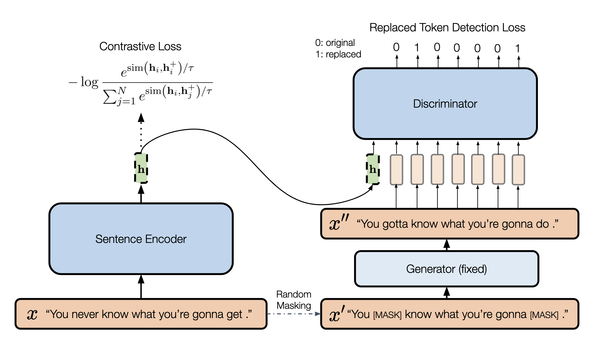

# NLP_DiffCSE

Reproduction and Improvements on [DiffCSE](https://arxiv.org/abs/2204.10298). Please refer to their [repository](https://github.com/voidism/DiffCSE) for more detailed information.

## Overview



DiffCSE is an unsupervised contrastive sentence embedding model that builds on the top of SimCSE and ELECTRA model with slight modification. Claimed by the authors, it achieves new state-of-the-art among other same category learning methods. We reproduce most of the ablation studies mentioned in the DiffCSE and propose three model variants for further analysis.

## Setups

[](https://www.python.org/downloads/release/python-395/)
[](https://pytorch.org/get-started/previous-versions/)

### Requirements
* Python 3.9.5

### Install our customized Transformers package
```
cd transformers-4.2.1
pip install .
```

### Install other packages
```
pip install -r requirements.txt
```

### Download the pretraining dataset
```
cd data
bash download_wiki.sh
```

### Download the downstream dataset
```
cd SentEval/data/downstream/
bash download_dataset.sh
```

## Training and Evaluation

We trained the model on single NVIDIA 2080 Ti applied from HKU GPU Farm. If your program does not require user interaction during execution, you can submit it to the system in batch mode. Your job will be scheduled in the background. You do not need to maintain a terminal session on the gateway node to wait for output. To submit a batch job, e.g. my-gpu-batch.sbatch:

```
#!/bin/bash

# Tell the system the resources you need. Adjust the numbers according to your need, e.g. 
#SBATCH --gres=gpu:1 --cpus-per-task=4 --mail-type=ALL

#If you use Anaconda, initialize it
. $HOME/anaconda3/etc/profile.d/conda.sh

# cd your your desired directory and execute your program, e.g.
cd <your directory>

LR=2e-6
MASK=0.15 #===Ablaion Study 3: Masking Ratio===
LAMBDA=0.05 #===Ablaion Study 4: Coefficient λ===

#===Variant 1: Temperature: change the value of temp===
python train.py \
    --model_name_or_path bert-base-uncased \
    --generator_name distilbert-base-uncased \
    --train_file data/wiki1m_for_simcse.txt \
    --output_dir <your_output_model_dir> \
    --num_train_epochs 2 \
    --per_device_train_batch_size 64 \
    --learning_rate $LR \
    --max_seq_length 32 \
    --evaluation_strategy steps \
    --metric_for_best_model stsb_spearman \
    --load_best_model_at_end \
    --eval_steps 125 \
    --pooler_type cls \
    --mlp_only_train \
    --overwrite_output_dir \
    --logging_first_step \
    --logging_dir <your_logging_dir> \
    --temp 0.05 \
    --do_train \
    --do_eval \
    --batchnorm \
    --lambda_weight $LAMBDA \
    --fp16 --masking_ratio $MASK
```

arguments:

* `--lambda_weight`: the lambda coefficient is for the loss, we changed it for ablation 4.
* `--masking_ratio`: the masking ratio for MLM generator to randomly replace tokens, we changed it for ablaion 3.
* `--generator_name`: the model name of generator. For `bert-base-uncased`, we use `distilbert-base-uncased`. For `roberta-base`, we use `distilroberta-base`.

* `--train_file`: Training file path (`data/wiki1m_for_simcse.txt`). 
* `--model_name_or_path`: Pre-trained checkpoints to start with such as BERT-based models (`bert-base-uncased`, `bert-large-uncased`, etc.) and RoBERTa-based models (`RoBERTa-base`, `RoBERTa-large`), and distillBERT-based models (`distillbert-base-uncased`) we added for variant 3. 
* `--temp`: Temperature for the contrastive loss. We changed it for variant 1.
* `--pooler_type`: Pooling method.
* `--mlp_only_train`: For unsupervised SimCSE or DiffCSE, it works better to train the model with MLP layer but test the model without it. You should use this argument when training unsupervised SimCSE/DiffCSE models.

## Type of Study

Model Analysis Study

### Reproduce

1. Removing contrastive loss
2. Next sentence vs. same sentence
3. Masking Ratio
4. Coefficient λ
5. Pooler choice

### Variant

1. Temperature
2. Dot Product
3. Knowledge distillation([Hinton et al., 2015](https://arxiv.org/abs/1503.02531)) 

### Main changes

For Reproduce of the ablation experiment 1, we modified in diffcse/models.py, beginning at line 306.

For abalation 2, we modified train.py, beginning at line 473.

For ablation 3, 4, and variant 1, they can be realized by changing in the sbatch file, which we have commented at corresponding lines.

For ablation 5, we modified in diffcse/models.py lines 56~68.

For Variant 2, we modified in diffcse/models.py, beginning at line 87 and 270.

For Variant 3, we modified the train.py(beginning ant line 361) and diffcse/models.py(beginning at line 10, 181, 483), and added a file: modeling_distillbert.py.

## Pretrained models

[](https://huggingface.co/voidism)

* DiffCSE-BERT-base (STS): https://huggingface.co/voidism/diffcse-bert-base-uncased-sts
* DiffCSE-BERT-base (transfer tasks): https://huggingface.co/voidism/diffcse-bert-base-uncased-trans
* DiffCSE-RoBERTa-base (STS): https://huggingface.co/voidism/diffcse-roberta-base-sts
* DiffCSE-RoBERTa-base (transfer tasks): https://huggingface.co/voidism/diffcse-roberta-base-trans

We can load the models using the API provided by [SimCSE](https://github.com/princeton-nlp/SimCSE). 
See [Getting Started](https://github.com/princeton-nlp/SimCSE#getting-started) for more information.

```python
from diffcse import DiffCSE
model_bert_sts = DiffCSE("voidism/diffcse-bert-base-uncased-sts")
model_bert_trans = DiffCSE("voidism/diffcse-bert-base-uncased-trans")
model_roberta_sts = DiffCSE("voidism/diffcse-roberta-base-sts")
model_roberta_trans = DiffCSE("voidism/diffcse-roberta-base-trans")
```
